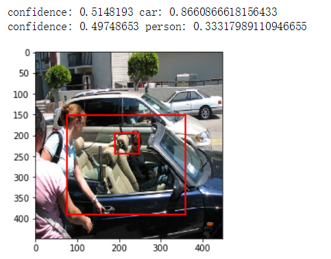

# tensorflow-YOLO

Tensorflow implementation of [YOLO](https://arxiv.org/pdf/1506.02640.pdf)

## Environment

- python 3.6
- tensorlayer 1.10.0
- tensorflow 1.9.0
- matplotlib 2.2.3
- itchat 1.3.10
- numpy 1.15.0
- tqdm 4.25.0

## Installation

1. Clone yolo_tensorflow repository
	```Shell
	$ git clone https://github.com/TooDifficultForMe/tensorflow-YOLO.git
    $ cd tensorflow-YOLO
	```

2. Download Pascal VOC dataset, and create correct directories
	```Shell
	$ ./download_data.sh
	```

3. Modify configuration in `config.py`

4. Training
	```Shell
	$ python train.py
	```

5. Move trained weight file in `data/weight`

5. Test

   open `test.ipynb` with Jupyter Notebook

## Results

1. Good Results

	
	
	
	

2. Bad Results

	
	
	